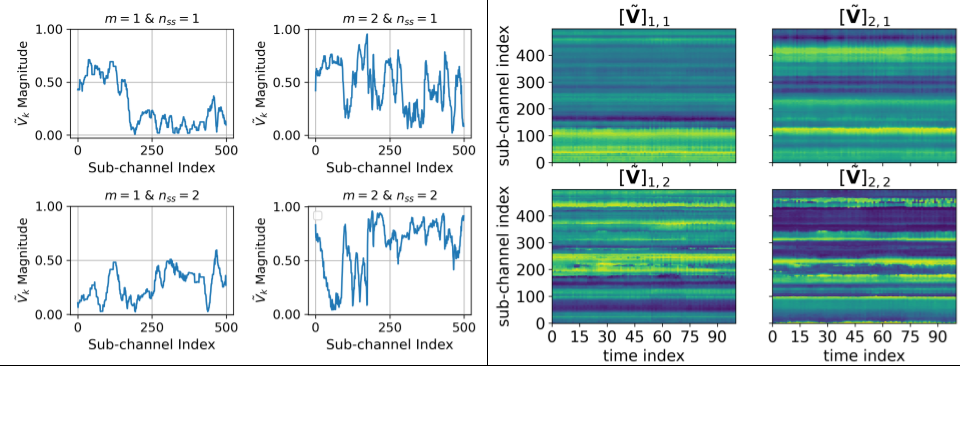

# Wi-BFI

This is the implementation of the paper [Wi-BFI: Extracting the IEEE 802.11 Beamforming Feedback Information from Commercial Wi-Fi Devices](https://dl.acm.org/doi/10.1145/3615453.3616514).

<br/>

### Wi-BFI is the first open-source tool for retrieving Wi-Fi beamforming feedback angles (BFAs) and reconstructing beamforming feedback information (BFI) in the form of Vmatrices 
<br/>

If you find the project useful and you use this code, please cite our paper:
<br/>

```

@inproceedings{10.1145/3615453.3616514,
author = {Haque, Khandaker Foysal and Meneghello, Francesca and Restuccia, Francesco},
title = {Wi-BFI: Extracting the IEEE 802.11 Beamforming Feedback Information from Commercial Wi-Fi Devices},
year = {2023},
isbn = {9798400703409},
publisher = {Association for Computing Machinery},
address = {New York, NY, USA},
url = {https://doi.org/10.1145/3615453.3616514},
doi = {10.1145/3615453.3616514},
pages = {104–111},
numpages = {8},
keywords = {compressed beamforming feedback, beamforming, Wi-Fi, multiple-input multiple-output (MIMO)},
location = {Madrid, Spain},
series = {WiNTECH '23}
}

```
<br/>
<br/>

First, clone the repository with ``` git@github.com:kfoysalhaque/Wi-BFI.git ``` and move into the directory with ``` cd  Wi-BFI ```

Then, Setup the conda environment with ``` conda env create -f wi-bfi.yml ```

You might also want to install packages like tshark, wireshark, and airmon-ng

```
sudo apt-get install tshark wireshark aircrack-ng

```
<br/>
<br/>

## Wi-BFI Usage
<br/>
### Extract BFAs and reconstruct Vmatrices from traces

If you already have the captured traces of the network (IEEE 802.11ac or 11ax), execute <strong> main.py </strong> with a few arguments like the following:

<br/>

```
python main.py <'file name'> <'standard'>  <'mimo'>  <'antenna-config'>  <'bandwidth'>  <'mac address'>  <'no packet to process'>  <'file to save Vmatrices'>  <'file to save BFAs'>

```

<br/>
Example: 

```
python main.py 11ax_SU_4x2_160.pcapng  AX  SU  4x2  160  20:c1:9b:fe:4f:ed  200  V_ax_su_4x2_160  bfa_ax_su_4x2_160

```

<br/>

Options for these arguments are noted here:

<br/>

```
<'file name'>: name of the trace

<'standard'>: 'AC' / 'AX'

**<'mimo'>**: 'SU' / 'MU'

<'antenna-config'>: '3x1' (with IEEE 802.11ac) / '4x2' (with IEEE 802.11ax)
  *we will keep adding different other configurations with both AC and AX*

<'bandwidth'>: '160' *(for AX only)* / '80'/ '40' / '20' *(for AX and AC)*

<'mac address'>: MAC address of the Beamformee from which you want to extract the BFAs and Vmatrices.

<'no packet to process'>: The number of packets that you want to process. *(Should be equal/less than the number of available packets in the trace with the pre-defined MAC address )*

<'file to save Vmatrices'>: Name of the file where you want to save the vmatrices

<'file to save BFAs'>: Name of the file where you want to save the BFAs

```

Sample plot of the Vmatrices:
<br/>



<br/>


### Real-time plot from live capture 
<br/>

I am assuming that you have already installed airmon-ng, tshark etc (the above mentioned packages). It has two steps (I) start live capture and (II) start live plot 

<br/>

<strong>(I) Start live capture</strong>

<br/>

Move into the *Demo* directory and execute *angle_collection.sh*:

```
./angle_collection.sh <'directory to save live captures'>  <'network interface with which you want to monitor (maybe your PC's network card)'>  <'bandwidth'> <'update interval'>

```
Example: Let's assume your phone is communicating with the Access Point (AP) and you want to monitor the BFAs and Vmatrices computed and transmitted by your phone (beamformee) to the AP. Now, if you want to save the live captures in a directory with the name *phone*, the network card with which you want to monitor is *wlp3s0* (for you, it can be your PC's wireless interface), the channel in which AP is tuned-- *36* for this case, bandwidth is 80 MHz and plot update interval is 1 second, then execute the following:

```
./angle_collection.sh phone wlp3s0 36 80 1

```

This will start the live capturing of the traces. 

<strong>(II) Start live plot</strong> 

<br/>
To see the live BFAs plot please execute:
<br/>

```
python main_live_plot.py <'standard'>  <'mimo'>  <'antenna-config'>  <'bandwidth'>  <'mac address'>  <'live_capture_directory(it should be *phone* as per example)'>  <'interval'>

```

#### You can find the demonstration of the live plot [here](https://youtu.be/0k7uYRCmMBw?si=HGkOYjEC4bzo8V7U).

#### For any question or query, please contact [Foysal Haque](https://kfoysalhaque.github.io/) at _**haque.k@northeastern.edu**


